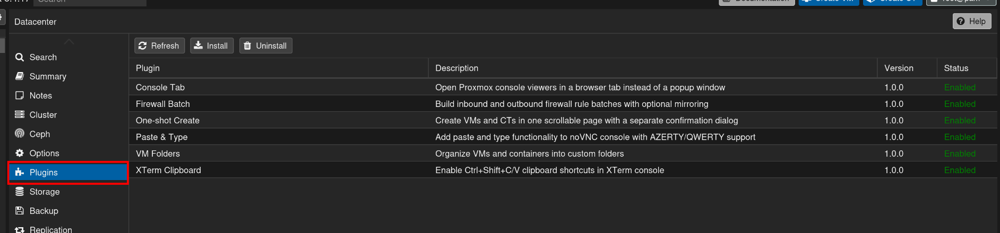

# Proxmox Plugin Manager

Small Proxmox VE plugin pack for UI tweaks and helpers:

- VM/CT create flow improvements
- VM folder organization in the tree
- noVNC paste/type helper
- console tab helper
- firewall batch helper
- xterm clipboard helper

## Where It Appears

The Plugin Manager is available in the Datacenter sidebar under `Plugins`.



## Requirements

- Proxmox VE host
- root access
- `bash`, `python3`, `base64`

`zip` is only needed if you rebuild the archive locally.

## Recommended install

Use the single-file installer:

```bash
git clone https://github.com/felix068/proxmox-plugin-manager.git
cd proxmox-plugin-manager
chmod +x install-proxmox-plugins-allinone.sh
sudo ./install-proxmox-plugins-allinone.sh
```

Steps:

1. Clone or copy the repository onto the Proxmox host.
2. Make the installer executable.
3. Run it as root.
4. Hard-refresh the browser after the installer finishes.

What it does:

- unpacks the embedded archive into a temporary directory
- runs `install.sh`
- installs the plugin manager service and all bundled plugins
- creates backups before modifying existing files

If you downloaded a release archive instead of cloning the repo, run the same script from the extracted folder.

## Alternative install

If you prefer the zip-based package:

```bash
chmod +x install-proxmox-plugins.sh
sudo ./install-proxmox-plugins.sh
```

The script expects `proxmox-plugins.zip` next to it.

## Manual install from the repo

```bash
sudo bash install.sh
```

## Backups

Backups are stored next to the files that are modified:

- Plugin manager backups: `/usr/share/pve-manager/plugin-backups/plugin-manager/<timestamp>/`
- UI plugin backups: `/usr/share/pve-manager/plugin-backups/<plugin>/<timestamp>/`
- noVNC plugin backups: `/usr/share/novnc-pve/plugin-backups/<plugin>/<timestamp>/`

While a plugin is installed, a `latest` symlink points to the active backup.

Files currently covered by the plugin manager backup flow include:

- `/usr/share/pve-manager/js/pvemanagerlib.js`
- `/usr/share/perl5/PVE/API2.pm`
- `/usr/share/perl5/PVE/API2/PluginManager.pm`
- `/usr/share/pve-manager/plugins/`
- `/usr/local/bin/pve-plugin-api.py`
- `/etc/systemd/system/pve-plugin-api.service`

## Uninstall

To remove the plugin manager and restore the latest backup:

```bash
sudo bash install.sh uninstall
```

This removes the installed files, restores the last backup when available, reloads systemd, and restarts Proxmox UI services.

## Manual restore

If you only want to restore the last plugin-manager backup:

```bash
sudo bash restore-plugin-manager-backup.sh
```

## Hotfix for old VM folders installs

If you already installed an older version that still has the VM folder refresh bug:

```bash
sudo bash fix-vm-folders-refresh.sh
```

## Notes

- After install, hard-refresh the browser (`Ctrl+F5`).
- If a plugin is installed through the UI, use its `Uninstall` button to remove it cleanly.
- The backup system is designed to restore the previous file state, not just delete the plugin files.
